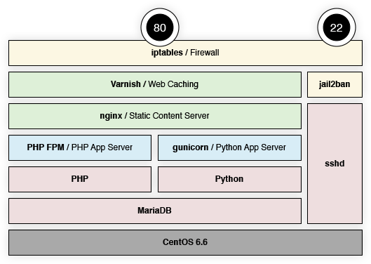

# Web Hosting Stack

When I first began working with Web hosting, Apache was the only tool I knew. While it's incredibly powerful for a wide range of hosting configurations, the compromise is performance.

I created these scripts to help automate setup of a Centos 6.6-based system for hosting both Python Django apps as well as Wordpress. You'll notice that sometimes I use the pre-built packages (via yum), and sometimes I elect to compile from source. Sometimes the EPEL is a bit behind in the current releases (for stability). Where appropriate, I've compiled the most recent stable version that hasn't made it in yet. It sets up this stack:

<center></center>

| Service | Port | Firewall | Note |
| ------- | ---- | -------- | ---- |
| **Varnish** | 80 | Public | Acts as the primary page cache, and should catch a majority of requests. |
| **nginx** | 8080 | Blocked | Handles serving up static content to Varnish. |
| **gunicorn** | 8000 | Blocked | Handles dynamic content for Python. |
| **Python** | - | - | My current favorite development language. The **Django** framework runs under Python. |
| **php-fpm** | 9000 | Blocked | Handles dynamic content for PHP. |
| **MariaDB** | 3306 | Blocked | Next-generation database. Fully MySQL compliant. |
| **ssh** | 22 | Public | Secure terminal shell service for managing the server through the CLI. We also use fail2ban for additional protection. |


## Server Setup
Sign in **as root** to your freshly-installed Centos 6.6 server (either at the console or via ssh), and issue the following command:

```bash
curl -s https://raw.githubusercontent.com/andrewmarconi/sysadmin-tools/master/centos-6.6/setup.sh | bash
```


## Adding the 'wheel' Group to Sudoers
The script automates the creation of a non-root user, and adds this account to the 'wheel' group. You need to manually enable the rule in the /etc/sudoers file to allow members of the 'wheel' group to run administrative commands. I've attempted to automate this, but it's currently broken (and commented out). Until this is fixed, as root, you need to type ```visudo``` from the command prompt, and uncomment out the following line:

```bash
# %wheel	ALL=(ALL)	ALL
```


## Configuring rmate and SSH Port Forwarding
If you have [TextMate 2](https://github.com/textmate/textmate) or GitHub's [Atom](https://github.com/atom/atom) installed locally as your text editor, you can enable "port forwarding" so that you can easily edit remote files on your local machine.

First, you need to install [rmate](https://github.com/textmate/rmate) on your remote server:

```bash
curl -Lo /usr/local/bin/rmate https://raw.githubusercontent.com/textmate/rmate/master/bin/rmate
chmod o+a /usr/local/bin/rmate
```

Next, you need to add the remote server to your *~/.ssh/config* file locally (this is for Mac OSX -- I've no idea how this is handled on Windows). If the file doesn't exist, create it, and then add this:

```bash
Host xxx.xxx.xxx.xxx
    RemoteForward 52698 localhost:52698
    User uuuuu
```
Of course, replace 'xxx.xxx.xxx.xxx' with your remote server's IP address. You may also use wildcards -- so, for instance if your server network segment is 192.168.5.1 through 192.168.5.255, then you can simply use 192.168.5. I use this frequently for servers on my local network, and use only the specific IP address for remote servers.

Also replace the 'uuuuu' with your **remote** user's name. I'd recommend this not be 'root' for security reasons.


## Additional Tools
This script installs and configures Solr, Tomcat, Java, and Postgresql. Not really important for the basic stack, but included here in case I need it.

```bash
curl -s https://raw.githubusercontent.com/andrewmarconi/sysadmin-tools/master/centos-6.6/additional-services.sh | bash
```
